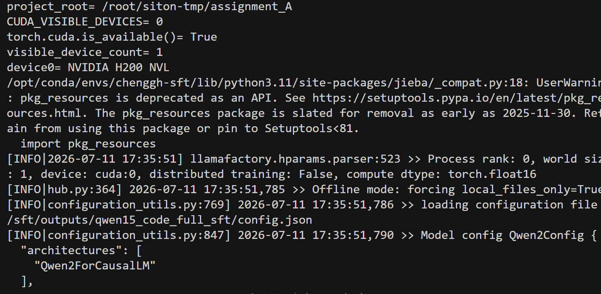
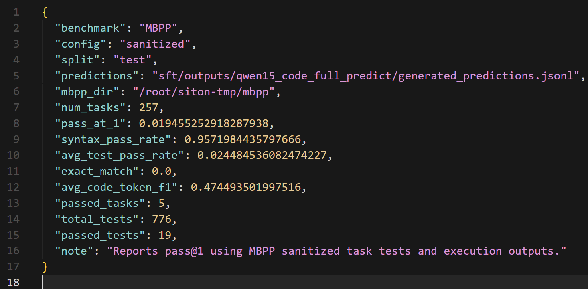
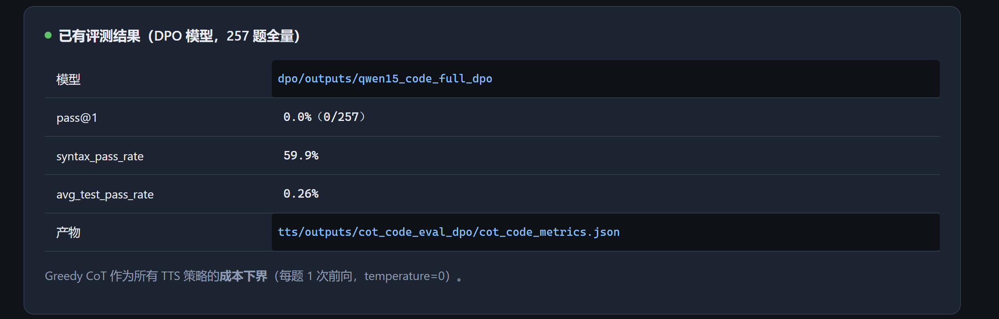
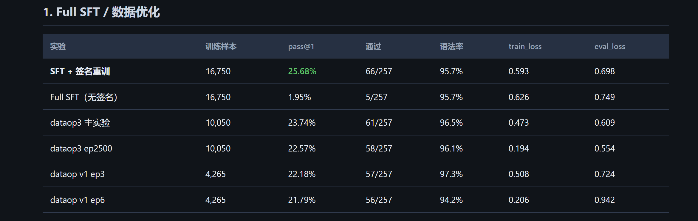
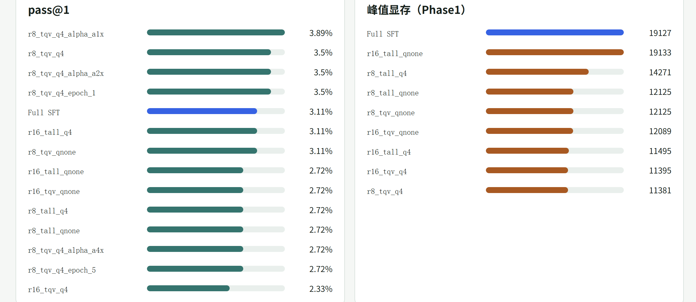
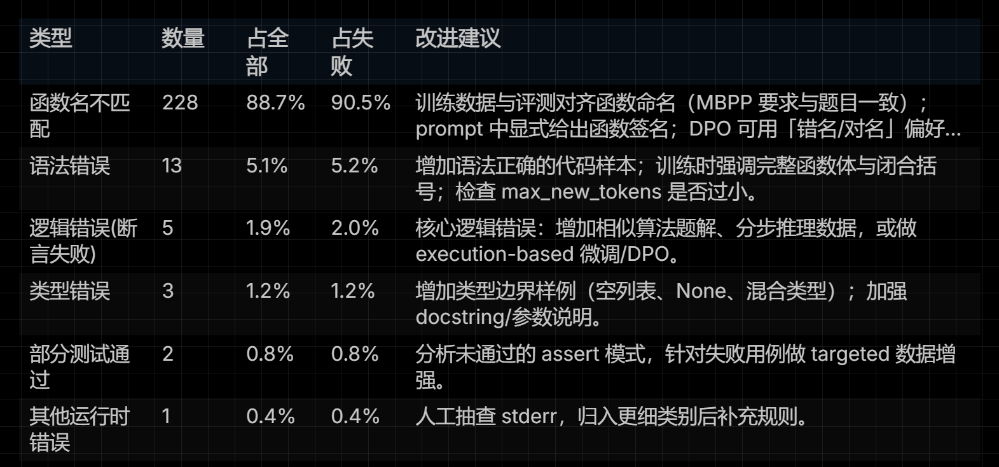
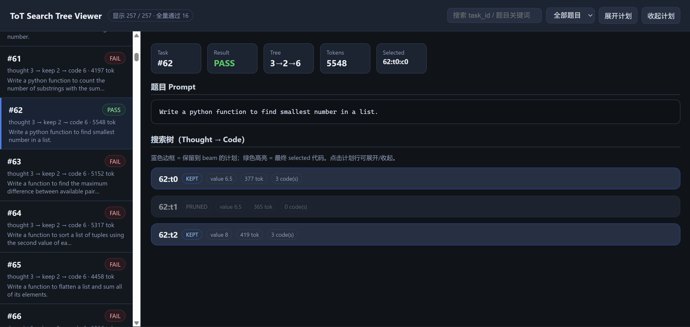
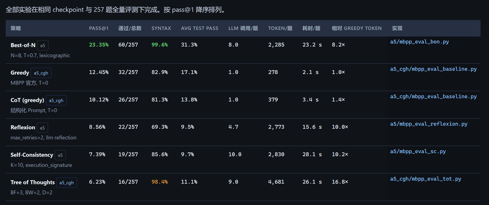

# 个人模块 README

> 姓名：程广辉 · 学号：20235818  
> 方向：A 方向 · 大模型微调与推理增强（代码生成）  
> 仓库：[assignmentA_bak](https://github.com/chenggh-tangerian/assignmentA_bak)  
> 负责范围：**A2 SFT 全流程与进阶**；**A5：Greedy / CoT / Tree of Thoughts**

---

## 1. 模块概述

### 1.1 模块名称

`A2 SFT 微调` + `A5 推理增强（Greedy / CoT / ToT）`

### 1.2 模块说明

```text
本模块在团队「代码生成大模型优化」链路中承担两段关键职责：

1）A2：在 Qwen1.5-0.5B-Chat 上完成指令监督微调（SFT），把 Alpaca 格式代码指令数据
   训成可评测的代码能力底座，并向 A4/A5 交付 checkpoint 与 MBPP 指标。

2）A5（部分）：在固定对齐后 checkpoint 上，不改权重，只改推理策略，对比
   Greedy / CoT / Tree of Thoughts 的 pass@1、token 成本与耗时，为团队选型提供依据。

输入：Alpaca SFT 数据、MBPP sanitized test、（A5）上游对齐 checkpoint。
输出：SFT / 推理评测产物（checkpoint、mbpp_metrics、token_cost、timing、错误分析等）。

为什么必要：没有 A2 就没有可用代码底座；没有 A5 基线与 ToT 对比，团队无法在
「准确率 vs 成本」上做 Test-Time Scaling 选型。
```

### 1.3 完成情况概览

| 类型 | 完成情况 |
|---|---|
| 基础要求 | **A2**：train → predict → evaluate 全流程已跑通；Base 0.39% → Full SFT **1.95%**（无签名协议）。**A5**：CoT 结构化输出 + before/after 对比产物已完成。 |
| 进阶要求 | **A2**：LoRA/QLoRA 13 组对比（最优 **3.89%**）、错误分析、签名对齐重训（**25.68%**）、数据筛选（dataop3 **23.74%**）、修复式 SFT。**A5**：Greedy 成本下界 + Tree of Thoughts（bf=3, bw=2, depth=2）。 |
| 可独立运行的演示 | `sft/scripts/{train,predict_full,evaluate_full}.sh`；`a5_cgh/scripts/eval_{greedy,cot,tot}.sh`；展示页 `SFT展示.html`、`a5_cgh/a5_tts_cmp.html` |
| 与团队系统集成情况 | 上游交 checkpoint 路径；下游交同构 JSON（metrics / token_cost / timing）；经 `comp/` 汇总看板 |

---

## 2. 环境、模型与数据依赖

### 2.1 运行环境

| 项目 | 要求 |
|---|---|
| Python 版本 | 3.11（推荐 conda 环境） |
| 必要依赖 | LLaMA-Factory（`-e` 安装）、`torch==2.5.1`、transformers / datasets 等（与仓库一致） |
| 是否需要模型 | 需要 |
| 是否需要 GPU | 需要（Full SFT / LoRA 训练与 MBPP 全量推理） |
| 是否需要外部数据集 | 需要（指令数据 + MBPP；A5 评测依赖已训好的 checkpoint） |

### 2.2 模型依赖

| 模型 | 来源 | 项目内相对路径 | 用途 |
|---|---|---|---|
| Qwen1.5-0.5B-Chat | Hugging Face / 实训公共路径 | `Qwen1.5-0.5B-Chat/` | A2 训练基座与 Base 评测 |
| SFT checkpoint | 本模块训练产出 | `sft/outputs*/` 或签名实验目录 | A2 预测 / 评测；可作下游参考 |
| PPO-1304（A5 默认底座） | 组内 A4/RL 产出 | `rl/outputs/train_lora_ppo_full/checkpoint-1304` | A5 Greedy/CoT/ToT 主对比 |

```bash
# 基座模型（示例；按实际公共服务器路径调整）
# hf download Qwen/Qwen1.5-0.5B-Chat --local-dir ./Qwen1.5-0.5B-Chat
```

### 2.3 数据集或样例数据依赖

| 数据或文件 | 来源 | 项目内相对路径 | 用途 |
|---|---|---|---|
| python_code_instructions_18k_alpaca | Hugging Face | 原始目录 → `sft/data/`（Alpaca JSON） | A2 SFT 训练 |
| MBPP sanitized test | `google-research-datasets/mbpp` | 评测脚本默认路径 / 预处理后 JSON | pass@1 评测（257 题） |
| 带签名训练/评测数据 | 本模块构造 | `sft/scripts_cgh/data/*_with_signature.json` | 签名对齐进阶实验 |
| A5 已有评测产物（可选） | 本模块跑出 | `a5_cgh/outputs/eval_{greedy,cot,tot}/` | 演示与复现对照 |

```bash
# 指令数据（示例）
# hf download --repo-type dataset iamtarun/python_code_instructions_18k_alpaca \
#   --local-dir ./python_code_instructions_18k_alpaca

# MBPP
# https://huggingface.co/datasets/google-research-datasets/mbpp
```

### 2.4 安装步骤

```bash
conda create -n your_env python=3.11 -y
conda activate your_env

# 在仓库根目录（含 LLaMA-Factory）
pip install -e ./LLaMA-Factory -i https://pypi.tuna.tsinghua.edu.cn/simple
pip install torch==2.5.1

cd assignmentA_bak   # 或你的项目根目录
```

最小独立演示：有 GPU、基座模型、MBPP、以及（A5）一个对齐 checkpoint 即可；不必拉起完整 DPO/看板。

---

## 3. 文件结构与接口边界

### 3.1 文件结构

```text
assignmentA_bak/
├── sft/
│   ├── scripts/
│   │   ├── train.sh                 # A2 基础：SFT 训练
│   │   ├── predict_full.sh          # A2 基础：全量预测
│   │   └── evaluate_full.sh         # A2 基础：MBPP 评测
│   ├── scripts_cgh/                 # A2 进阶（签名 / 错误分析等）
│   │   ├── analyze_errors.py
│   │   ├── prepare_*_with_signature*.py / .sh
│   │   ├── run_sft_signature_full.sh
│   │   └── run_analysis.sh
│   ├── lora2_exp_cgh/               # LoRA/QLoRA 13 组对比
│   ├── dataop* / sft_cgh_dataop*    # 数据筛选实验
│   └── sft_cgh2/                    # 修复式 SFT
├── a5_cgh/                          # A5：Greedy / CoT / ToT
│   ├── scripts/
│   │   ├── eval_greedy.sh
│   │   ├── eval_cot.sh
│   │   ├── eval_tot.sh
│   │   └── build_tot_tree_html.py
│   ├── tree_of_thoughts.py
│   ├── cot_prompt.py
│   ├── mbpp_eval_*.py
│   └── outputs/eval_{greedy,cot,tot}/
└── report/appendix/                 # CoT 对比 metrics / comparison.*
```

### 3.2 接口边界

| 类型 | 来源 / 去向 | 数据格式 | 说明 |
|---|---|---|---|
| 输入（A2） | A1 产出或 `sft/data/`；用户指定 `MODEL_PATH` | Alpaca JSON + yaml 配置 | 训练 / 预测 |
| 输入（A5） | 组内 A4/RL checkpoint；MBPP | 本地路径 + 评测集 | 默认 PPO-1304 |
| 输出（A2） | 本目录 `outputs*`；交给 A4/A5 / `comp/` | checkpoint + `mbpp_metrics.json` 等 | 代码能力底座与指标 |
| 输出（A5） | `a5_cgh/outputs/*`；交给 `comp/` | `mbpp_metrics_*` / `token_cost.json` / `timing.json` | 与 SC/BoN/Reflexion 同构 |

---

## 4. 基础要求实现与演示

### 4.1 基础功能说明

```text
【A2 基础 · 对应任务书 A2 基础要求】
- 熟悉 SFT 训练 / 预测 / 评测脚本结构
- 用 sft/scripts/train.sh 完成模型训练
- 用 predict_full.sh 生成预测
- 用 evaluate_full.sh 完成结果评测
- 记录日志并对比 Base vs Full SFT 效果

【A5 基础 · 对应任务书 A5 基础要求】
- 使用 CoT few-shot / 结构化 prompt，让模型输出 reasoning、key steps、final code
- 产出 before/after 对比：metrics.json、comparison.jsonl、comparison.md
```

### 4.2 基础功能实现路径

| 文件 / 函数 / 脚本 | 作用 |
|---|---|
| `sft/scripts/train.sh` | 启动 LLaMA-Factory Full SFT |
| `sft/scripts/predict_full.sh` | 对测试集生成 `generated_predictions.jsonl` |
| `sft/scripts/evaluate_full.sh` | MBPP 执行评测 → `mbpp_metrics.json` |
| `a5_cgh/cot_prompt.py` / `scripts/eval_cot.sh` | CoT 结构化推理评测入口 |
| `report/appendix/{metrics.json,comparison.jsonl,comparison.md}` | CoT before/after 对比产物 |

```text
【A2】Alpaca 数据 + 基座 -> train.sh -> checkpoint -> predict_full.sh -> evaluate_full.sh -> mbpp_metrics.json
【A5】对齐 checkpoint + MBPP -> eval_cot.sh -> metrics / cases / token_cost / timing
```

### 4.3 基础功能输入格式与样例

| 字段 / 输入文件 | 类型 / 格式 | 是否必需 | 说明 |
|---|---|---|---|
| `MODEL_PATH` | 目录路径 | 是 | 基座或已训 checkpoint |
| SFT 训练数据 | Alpaca JSON | A2 训练时必需 | `instruction` / `input` / `output` |
| MBPP sanitized test | JSON / HF dataset | 评测必需 | 固定 257 题协议 |
| `BATCH_SIZE` / `GPU_ID` | 环境变量 | 否 | 控制吞吐与卡号 |
| `LIMIT`（A5） | int | 否 | 冒烟时限制题数 |

| 样例文件 | 用途 |
|---|---|
| `sft/data/code_sft_*.json` | 验证 A2 数据注册与训练可读 |
| `a5_cgh/outputs/eval_cot/*`（已有） | 验证 CoT 输出字段与指标格式 |

### 4.4 基础功能演示命令

```bash
cd assignmentA_bak   # 项目根目录

# ---- A2 基础全流程 ----
bash sft/scripts/train.sh
MODEL_PATH=<your_sft_checkpoint> bash sft/scripts/predict_full.sh
bash sft/scripts/evaluate_full.sh

# ---- A5 CoT（先冒烟再全量）----
LIMIT=2 bash a5_cgh/scripts/eval_cot.sh
bash a5_cgh/scripts/eval_cot.sh
```

运行后应观察：

- 训练目录出现 checkpoint、`trainer_log.jsonl`
- 预测目录出现 `generated_predictions.jsonl`、`predict_results.json`
- 评测目录出现 `mbpp_metrics.json`、`mbpp_cases.jsonl`
- CoT 输出含 reasoning / key steps / final code，并写入 metrics 与对比文件

### 4.5 基础功能输出格式

| 输出文件 / 返回字段 | 格式 | 说明 |
|---|---|---|
| `checkpoint-*` | 模型权重 | SFT 训练产物 |
| `generated_predictions.jsonl` | JSONL | 逐题生成 |
| `mbpp_metrics.json` | JSON | pass@1 等汇总 |
| `mbpp_cases.jsonl` | JSONL | 逐题通过/失败细节 |
| `a5_cgh/outputs/eval_cot/mbpp_metrics_cot.json` | JSON | CoT pass@1 / token / timing |
| `report/appendix/comparison.md` | Markdown | CoT 前后对比可读报告 |

### 4.6 基础功能结果截图

训练启动：



测评效果：



CoT实验结果展示：




---

## 5. 进阶要求实现与演示

### 5.1 选择的进阶要求

| 进阶要求 | 是否完成 | 对应文件 / 函数 | 简要说明 |
|---|---|---|---|
| A2：LoRA / QLoRA + 超参对比 | 是 | `sft/lora2_exp_cgh/` | 13 组；最优 `r8_tqv_q4_alpha_a1x` → **3.89%**，峰值显存约 11.4 GB |
| A2：错误分析模块 | 是 | `sft/scripts_cgh/analyze_errors.py` | 语法 / 函数名 / 边界 / 超时 / 断言失败等分类报告 |
| A2：签名对齐 + 数据筛选 | 是 | `scripts_cgh/*signature*`、`dataop*` | 签名重训 **25.68%**；dataop3 **23.74%**（约 60% 数据） |
| A2：修复式 SFT | 是 | `sft_cgh2/` | `题目 + 错误代码 + 报错 → 修复代码` |
| A5：Greedy 基线 | 是 | `a5_cgh/scripts/eval_greedy.sh` | T=0，成本下界，pass@1 **12.45%** |
| A5：Tree of Thoughts | 是 | `a5_cgh/tree_of_thoughts.py`、`eval_tot.sh` | bf=3, bw=2, depth=2；pass@1 **6.23%**，成本高 |

> Self-Consistency / Best-of-N / Reflexion 由其他组员负责；本 README 不展开，仅在集成表中对照。

### 5.2 进阶功能 1：LoRA / QLoRA 超参对比 + 错误分析 + 签名对齐

#### 功能说明

```text
基础 Full SFT 在无签名协议下仅 1.95%，且显存高。进阶做了三件事：
1）把 Full SFT 改为 LoRA/QLoRA，系统扫 rank / alpha / target / 量化 / epoch；
2）对失败 case 做错误归因，确认主因约一半是逻辑断言失败；
3）把函数签名注入训练与评测，并配合数据筛选，大幅抬升签名协议下的 pass@1。

对团队的帮助：给出可复现的省显存配方，以及「评测协议必须钉死」的结论，避免 A4/A5 混比分数。
```

#### 实现路径

| 文件 / 函数 / 脚本 | 作用 |
|---|---|
| `sft/lora2_exp_cgh/` | 13 组 LoRA/QLoRA 实验配置与结果 |
| `analyze_errors.py` → `classify_stderr` | 按 stderr / error_type 归类失败 |
| `prepare_*_with_signature*.py` | 训练/评测集注入函数签名 |
| `run_sft_signature_full.sh` | 签名数据重训 + 评测一键流 |
| `dataop*` / `sft_cgh_dataop*` | 高质量子集筛选 |

```text
失败 case -> analyze_errors -> 归因报告
     |
签名注入数据 -> train_with_signature -> 签名协议评测 -> mbpp_metrics
并行：LoRA 网格 -> 显存 / pass@1 对照表
```

#### 输入格式与样例

| 字段 / 输入文件 / 配置项 | 类型 / 格式 | 是否必需 | 说明 |
|---|---|---|---|
| `lora_rank` / `lora_alpha` / `lora_target` / `quantization_bit` | 训练配置 | 是（LoRA 实验） | 对照任务书进阶超参 |
| `*_with_signature.json` | Alpaca / MBPP JSON | 签名实验必需 | 含函数签名字段或 prompt 注入 |
| baseline `mbpp_cases.jsonl` | JSONL | 错误分析必需 | 作为归因输入 |

#### 演示命令

```bash
# 错误分析
bash sft/scripts_cgh/run_analysis.sh

# 签名数据准备 + 全流程（训练较久，注意 GPU）
bash sft/scripts_cgh/prepare_signature_data.sh
GPU_ID=0 bash sft/scripts_cgh/run_sft_signature_full.sh

# LoRA/QLoRA：按 lora2_exp_cgh 内各实验配置启动（见该目录说明）
```

#### 输出格式

| 输出文件 / 返回字段 | 格式 | 说明 |
|---|---|---|
| `error_analysis*.md` / `.json` | MD / JSON | 错误类型分布与样例 |
| 签名实验 `mbpp_metrics.json` | JSON | 签名协议 pass@1（峰值 **25.68%**） |
| LoRA 各组 eval 指标 | JSON | 最优无签名协议 **3.89%** |

#### 示例图片

数据优化结果：



LoRA等实验探究结果：



baseline错误分析报告统计：



**LoRA / QLoRA 结论摘要（对照 Full SFT 无签名 1.95%）**

| 实验ID | 要点 | pass@1 | 峰值显存 |
|--------|------|--------|----------|
| **r8_tqv_q4_alpha_a1x** | rank8 / qv / 4bit / α=1×r | **3.89%** | ~11381 MiB |
| r8_tqv_q4_alpha_a4x | α 过大 | 2.72% | 同左 |
| r8_tqv_q4_epoch_5 | epoch 过大过拟合 | 2.72% | — |

### 5.3 进阶功能 2：Greedy 基线与 Tree of Thoughts

#### 功能说明

```text
在固定底座 PPO-1304 上比较 Test-Time Scaling：
- Greedy：官方 MBPP prompt，temperature=0，作为成本与准确率下界；
- ToT：thought 生成 → 打分剪枝 → code 扩展 → verifier 选优（实验：bf=3, bw=2, depth=2）。

结果：Greedy 12.45%（~278 token/题）；ToT 6.23%（~4681 token/题）。本设定下 ToT/CoT
未超过 Greedy——负结果本身是选型依据：复杂搜索不一定换来更高 pass@1。
```

#### 实现路径

| 文件 / 函数 / 脚本 | 作用 |
|---|---|
| `scripts/eval_greedy.sh` + `mbpp_eval_baseline.py` | Greedy 评测 |
| `tree_of_thoughts.py` | ToT 搜索与剪枝 |
| `scripts/eval_tot.sh` + `mbpp_eval_tot.py` | ToT 全量评测入口 |
| `scripts/build_tot_tree_html.py` | 搜索树可视化 |
| `token_stats.py` / `eval_common.py` | 统一 token_cost / timing |

```text
MBPP task -> [Greedy: 单次解码] 或 [ToT: thoughts -> prune -> codes -> verify]
         -> metrics + token_cost + timing（与组内 BoN/SC 同构）
```

#### 输入格式与样例

| 字段 / 输入文件 / 配置项 | 类型 / 格式 | 是否必需 | 说明 |
|---|---|---|---|
| `MODEL_PATH` | checkpoint 路径 | 是 | 默认 PPO-1304 |
| `LIMIT` | int | 否 | 冒烟 |
| `BATCH_SIZE` / `GPU_ID` | 环境变量 | 否 | 吞吐与设备 |
| ToT `branch_factor` / `beam_width` / `depth` | 脚本内配置 | 是（ToT） | 实验固定 3 / 2 / 2 |

#### 演示命令

```bash
# 冒烟
LIMIT=2 bash a5_cgh/scripts/eval_greedy.sh
LIMIT=2 bash a5_cgh/scripts/eval_tot.sh

# 全量（耗时随 GPU 变化；ToT 明显更慢）
bash a5_cgh/scripts/eval_greedy.sh
bash a5_cgh/scripts/eval_tot.sh

# 可选：换底座
MODEL_PATH=rl/outputs/train_lora_ppo_full/checkpoint-1304 \
  bash a5_cgh/scripts/eval_greedy.sh

# ToT 树可视化
python a5_cgh/scripts/build_tot_tree_html.py
```

#### 输出格式

| 输出文件 / 返回字段 | 格式 | 说明 |
|---|---|---|
| `mbpp_metrics_greedy.json` / `mbpp_metrics_tot.json` | JSON | pass@1 等 |
| `token_cost.json` / `timing.json` | JSON | 成本与耗时 |
| `tot_trees_compact.json` / HTML | JSON / HTML | ToT 搜索过程 |

| A5 策略（底座 PPO-1304） | pass@1 | Token/题 | 说明 |
|---------|--------|----------|------|
| Greedy | **12.45%** | ~278 | 成本下界 |
| CoT | 10.12% | ~379 | −2.3 pp |
| ToT | 6.23% | ~4681 | 高成本、本设定未兑现 |
| Best-of-N（组内横向） | **23.35%** | ~8× | 最有效 TTS |

#### 示例图片

ToT可视化分析：



各TTS策略对比实验结果展示截图：



## 6. 与团队系统的集成说明

- **调用位置**：A2 由组内训练流水线 / 手工脚本调用；A5 由 `a5_cgh/scripts/eval_*.sh` 独立运行，指标汇总进 `comp/` 看板（`bash comp/serve.sh` → http://localhost:8787）。
- **传入参数**：主要是 `MODEL_PATH`、`GPU_ID`、`BATCH_SIZE`、`OUTPUT_DIR`、`LIMIT`；A2 另依赖 yaml 配置与 `dataset_info.json` 注册名。
- **返回结果**：A2 → checkpoint 路径 + `mbpp_metrics.json`；A5 → `mbpp_metrics_*` + `token_cost.json` + `timing.json`。
- **依赖中间产物**：A5 默认依赖组内 RL 的 `checkpoint-1304`；对比看板依赖各模块同构 JSON。
- **联调注意**：
  - 签名协议分数（如 25.68%）与统一 zero-shot 总表（SFT 参考 **11.67%**）**禁止混读**；
  - 偏好方法勿直接用 final ckpt 下结论（组内约定 early stop ≈ 400 step）；
  - A5 与组员 SC/BoN/Reflexion 对齐同一底座与指标字段，才能在一张表上选型（训练侧倾向 ORPO@400 / PPOv2；推理侧准确率优先 BoN，成本优先 Greedy）。

**分工交接简表**

| 角色 | 姓名 | 模块 |
|------|------|------|
| 本人 | 程广辉 | A2 全流程+进阶；A5 Greedy/CoT/ToT |
| 组长 | 陈家琪 | A4 DPO 系列与对比看板;A5 SC / Best-of-N / Reflexion |
| 组员 | 杨玙璠 | A3 偏好数据构造 |
| 组员 | 李佳汶 | A1 指令数据构造 |

---

## 7. 已知问题与后续改进

| 问题 | 当前原因 | 后续改进 |
|---|---|---|
| CoT / ToT 未超过 Greedy | 提示词改写生成分布，且搜索成本高、逻辑收益未兑现 | 换更强底座或更好 verifier；把 prompt 改写幅度纳入对照实验 |
| 签名评测与 zero-shot 易被混比 | 协议不同导致数量级差距 | 文档与看板强制分列两套表 |
| Full DPO 等同点掉分（组内现象） | 过对齐 | 训练侧坚持 early stop；本模块交付指标时标注协议与步数 |

---

## 附：快速验收检查清单

- [ ] `bash sft/scripts/train.sh`（或已有 checkpoint）可演示 A2 基础链路  
- [ ] `evaluate_full.sh` 能产出 `mbpp_metrics.json`  
- [ ] `LIMIT=2 bash a5_cgh/scripts/eval_{greedy,cot,tot}.sh` 冒烟通过  
- [ ] 能说明 LoRA 最优组、签名重训、以及 CoT/ToT 相对 Greedy 的负结果原因  
- [ ] 指标 JSON 可被 `comp/` 读取，与组员模块字段一致  
)
